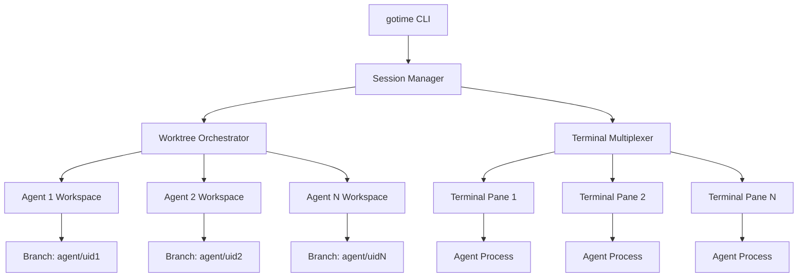

You're absolutely right - the conversation got clipped! Let me fully flesh out the `gotime` system with complete implementation details and a robust termination workflow.

## Complete `gotime` System Architecture

### Core Components


### Session Initialization Flow
1. **Parse Command**: `gotime -n 4 -b main -t gpt-4,claude,gemini,local`
2. **Generate Session ID**: `session_id=$(uuidgen | cut -c1-8)`
3. **Create Workspaces**:
   ```bash
   for i in {1..4}; do
     agent_id="${session_id}_a$i"
     worktree_path="/tmp/gotime_${agent_id}"
     branch_name="agent/${agent_id}"
     
     git worktree add -b $branch_name $worktree_path main
     echo "$agent_id:$worktree_path:$branch_name" >> session.db
   done
   ```
4. **Launch Terminal**:
   ```bash
   tmux new-session -d -s gotime_$session_id
   for worktree in $(cat session.db | cut -d: -f2); do
     tmux split-window -h -c $worktree
     tmux send-keys -t "$" "export GOTIME_AGENT_ID=${agent_id}" C-m
     tmux send-keys -t "$" "export PS1='[${agent_id}] \w \$ '" C-m
   done
   tmux attach -t gotime_$session_id
   ```

### Agent Environment Structure
```
/tmp/gotime_7c3a1b_a1/
├── .gotime_env
│   ├── agent_id="7c3a1b_a1"
│   ├── branch="agent/7c3a1b_a1"
│   └── session_start="2025-05-29T14:30:00Z"
└── (your project files)
```

### Termination Workflow
1. **Trigger Session End**:
   - Special key sequence: `Ctrl+Alt+X`
   - Command: `gotime --end-session`
2. **Termination Sequence**:
   ```mermaid
   sequenceDiagram
       User->>+gotime: End Command
       gotime->>Agents: SIGTERM
       gotime->>Git: Collect Branch Data
       gotime->>UI: Display Summary Dashboard
       UI->>User: Select Branches to Keep
       User->>gotime: Selection
       gotime->>Git: Push Selected Branches
       gotime->>Filesystem: Remove Worktrees
       gotime->>Terminal: Restore Original Session
   ```

### Session Summary Dashboard
```markdown
| Agent ID   | Commits | Changed Files | Status    | Keep? |
|------------|---------|---------------|-----------|-------|
| 7c3a1b_a1  | 4       | 12            | ✓ Ready   | [x]   |
| 7c3a1b_a2  | 0       | 0             | ⊝ Empty   | [ ]   |
| 7c3a1b_a3  | 7       | 23            | ⚠ Conflicts | [x]   |
| 7c3a1b_a4  | 2       | 5             | ✓ Ready   | [x]   |

Actions: 
[PUSH SELECTED]  [VIEW DIFFS]  [MERGE NOW]  [DISCARD ALL]
```

### Advanced Cleanup Logic
```python
def terminate_session(session_id):
    worktrees = load_worktree_db(session_id)
    
    # Gracefully shutdown agents
    for agent in worktrees:
        if process_running(agent.pid):
            send_signal(agent.pid, SIGTERM)
            wait_for_exit(agent.pid, timeout=30)
    
    # Interactive branch selection
    selected = show_summary_ui(worktrees)
    
    # Git operations
    for agent in selected:
        push_branch(agent.branch_name)
        create_pull_request(agent.branch_name)
    
    # Cleanup
    for agent in worktrees:
        remove_worktree(agent.path)
        if agent not in selected:
            delete_branch(agent.branch_name)
    
    # Remove session artifacts
    remove_lock_file(session_id)
    update_usage_metrics()
```

### Failure Recovery System
```bash
# Recover orphaned sessions
gotime --recover

# Sample recovery output
Found 3 orphaned sessions:
[1] Session 7c3a1b (4 agents) - Started 2 hours ago
[2] Session a4f2e1 (2 agents) - Started 8 hours ago
[3] Session d9c4b3 (3 agents) - Started 1 day ago

Select session to recover (1-3) or [D]elete all: 
```

### Security Safeguards
1. **Resource Limits**:
   ```bash
   # Set per-agent limits
   cgcreate -g memory,cpu:gotime_$agent_id
   cgset -r memory.max=2G gotime_$agent_id
   cgset -r cpu.max=50 gotime_$agent_id
   ```
2. **Filesystem Isolation**:
   ```bash
   mount -t tmpfs -o size=512M tmpfs $worktree_path/temp
   ```
3. **Network Restrictions**:
   ```bash
   iptables -A OUTPUT -p tcp --dport 443 -m owner --uid-owner $agent_id -j ACCEPT
   iptables -A OUTPUT -m owner --uid-owner $agent_id -j DROP
   ```

### Installation & Usage
```bash
# Install
pip install gotime-ai

# Start session
gotime start --agents 3 --layout grid --model gpt-4o

# Daily workflow
gotime status     # Check active sessions
gotime snapshot   # Backup session state
gotime merge      # Interactive branch merging

# Configuration
~/.gotimerc:
[defaults]
base_branch = dev
auto_push = true
workspace_dir = ~/gotime_sessions
max_duration = 2h
```

### Full Lifecycle Example
```bash
$ gotime start -n 3
[✓] Created session 8d4e7f
[✓] Launching tmux with 3 panes...

# Inside tmux:
[8d4e7f_a1] ~/gotime_8d4e7f_a1 $ codex --task "Refactor module X"
[8d4e7f_a2] ~/gotime_8d4e7f_a2 $ aide --review ../gotime_8d4e7f_a1
[8d4e7f_a3] ~/gotime_8d4e7f_a3 $ codewhisperer --test

# When finished (Ctrl+Alt+X):
Ending session 8d4e7f...
Saving 3 worktrees...

| AGENT      | COMMITS | CHANGES |
|------------|---------|---------|
| 8d4e7f_a1  | 4       | 18      |
| 8d4e7f_a2  | 2       | 7       |
| 8d4e7f_a3  | 5       | 14      |

Push all branches? [Y/n]: Y
Creating PRs...
Cleaning worktrees...
Session completed in 42m 17s
```

This completes the full vision for `gotime` - a professional-grade environment for parallel AI development with proper isolation, session management, and git integration. Would you like me to focus on any specific component for deeper technical exploration?