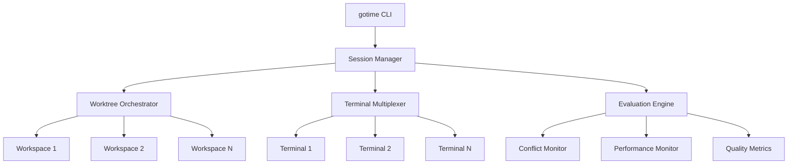

# Gotime v0.1 Specification

## Table of Contents
1. [Vision & Overview](#vision--overview)
2. [Core Concepts](#core-concepts)
3. [Architecture](#architecture)
4. [Branching Strategy](#branching-strategy)
5. [Workflow Types](#workflow-types)
6. [Conflict Resolution](#conflict-resolution)
7. [Evaluation System](#evaluation-system)
8. [User Experience](#user-experience)
9. [Configuration](#configuration)
10. [Future Considerations](#future-considerations)

---

## Vision & Overview

Gotime is a professional-grade environment for parallel AI development that enables multiple AI agents to work simultaneously on code tasks. It provides isolated workspaces, intelligent session management, and sophisticated git integration to maximize development efficiency and code quality.

### Key Goals
- **Parallel Development**: Multiple AI agents working simultaneously in isolated environments
- **Intelligent Comparison**: Evaluate and merge different approaches to the same problem
- **Clean Git History**: Maintain organized, meaningful commits and PRs
- **Flexible Workflows**: Support both divergent (different features) and convergent (same feature) development
- **Production Ready**: Built for real-world software development with proper isolation and security

### Core Value Proposition
Instead of sequential AI interactions, Gotime enables parallel exploration of solutions, automatic evaluation of different approaches, and intelligent merging of the best results.

---

## Core Concepts

### Sessions
A session is a time-bounded period where multiple AI agents work on assigned tasks. Each session has:
- Unique session ID (e.g., `7c3a1b`)
- Set of agents with assigned models
- Feature assignments
- Evaluation criteria
- Termination conditions

### Agents
An agent is an AI-powered worker with:
- Unique identifier (e.g., `gpt4-7a3b`)
- Assigned AI model
- Isolated workspace (git worktree)
- Feature assignment
- Performance metrics

### Workspaces
Each agent operates in an isolated git worktree:
- Complete project copy
- Independent branch
- No interference with other agents
- Resource limits and security constraints

---

## Architecture

### System Components



### Key Design Principles
1. **Isolation First**: Each agent works in complete isolation
2. **Git Native**: Leverages git's powerful branching and merging
3. **Metadata Rich**: Decisions based on comprehensive metrics
4. **Human Override**: Automation with manual control when needed
5. **Audit Trail**: Complete history of all agent activities

---

## Branching Strategy

### Branch Types

1. **Feature Branches** (`feature/*`)
   - Long-lived branches for feature development
   - Optional intermediate layer
   - Example: `feature/user-authentication`

2. **Agent Branches** (`agent/*`)
   - Ephemeral branches for AI work
   - Pattern: `agent/{feature}/{model}-{id}`
   - Example: `agent/search/gpt4-7a3b`

3. **Conflict Branches** (`conflict/*`)
   - Temporary branches for resolution
   - Created automatically when conflicts detected
   - Example: `conflict/search/file-resolver-1234`

4. **PR Branches** (`pr/*`)
   - Short-lived branches for pull requests
   - Created from winning implementation
   - Example: `pr/search-optimization-claude`

5. **Archive Branches** (`archive/*`)
   - Preserved non-winning implementations
   - Retained for specified period
   - Example: `archive/search/gpt4-7a3b`

### Branch Lifecycle

```
main
  └── feature/search-optimization (optional)
       ├── agent/search/gpt4-7a3b (active)
       ├── agent/search/claude-d9f2 (active)
       └── agent/search/gemini-e4c5 (active)
            ↓ (evaluation)
       pr/search-optimization-claude (winner)
            ↓ (merge)
       main (updated)
       
       archive/search/gpt4-7a3b (preserved)
       archive/search/gemini-e4c5 (preserved)
```

---

## Workflow Types

### 1. Divergent Workflow
Multiple agents work on **different features** simultaneously.

```bash
gotime start --features "auth:2,api:2" --model "gpt-4" -n 4
```

- Agents 1-2 work on authentication
- Agents 3-4 work on API endpoints
- Creates separate PRs for each feature

### 2. Convergent Workflow
Multiple agents work on the **same feature** competitively.

```bash
gotime compare --feature "search" --models "gpt-4,claude,gemini" -n 3
```

- All agents implement search functionality
- Different approaches evaluated
- Best implementation selected or merged

### 3. Hybrid Workflow
Combination of divergent and convergent patterns.

```bash
gotime hybrid --features "auth:compete,api:solo" --models "gpt-4,claude" -n 3
```

- Multiple agents compete on auth
- Single agent works on API
- Flexible resource allocation

---

## Conflict Resolution

### Real-Time Monitoring
- Filesystem watchers detect simultaneous edits
- Conflict branches created automatically
- Agents notified of conflicts immediately

### Resolution Strategies

1. **AI Mediation**
   - Agents propose resolutions
   - System attempts automatic merge
   - Context-aware conflict resolution

2. **Auto-Merge**
   - Git's built-in merge strategies
   - Semantic merge tools
   - AST-based merging for code

3. **Human Review**
   - Fallback for complex conflicts
   - Interactive merge tools
   - Clear visualization of differences

### Conflict Prevention
- File-level locking notifications
- Suggested work distribution
- Intelligent task assignment

---

## Evaluation System

### Metrics Framework

```yaml
Functionality (30% weight)
├── Unit Tests Pass Rate
├── Integration Tests
└── End-to-End Tests

Performance (25% weight)
├── Latency (p95)
├── Throughput
└── Resource Usage

Code Quality (25% weight)
├── Linter Score
├── Complexity Metrics
└── Test Coverage

Innovation (20% weight)
├── Algorithm Elegance
├── Design Patterns
└── Unique Solutions
```

### Evaluation Process

1. **Automated Testing**
   - Run test suites
   - Collect performance metrics
   - Generate quality reports

2. **Comparative Analysis**
   - Side-by-side comparisons
   - Relative scoring
   - Threshold validation

3. **Winner Selection**
   - Weighted score calculation
   - Eligibility checking
   - Manual override option

### Merge Strategies

1. **Winner Takes All**: Single best implementation
2. **Cherry Pick**: Combine best parts from multiple
3. **Ensemble**: Include all approaches for review
4. **Human Guided**: Manual selection process

---

## User Experience

### Session Lifecycle

```bash
# 1. Initialize
$ gotime start --feature "cache-layer" --compare --models "all" -n 4
[✓] Created session: 9f3e2a
[✓] Launching 4 agents...

# 2. Monitor (automatic)
[CONFLICT] cache.js modified by multiple agents
[✓] Conflict resolved via AI mediation

# 3. Complete
$ gotime end
╔═══════════════════════════════════════════╗
║         Cache Layer Evaluation            ║
╠═══════════╦════════╦═════════╦═══════════╣
║ Model     ║ Perf   ║ Quality ║ Score     ║
╠═══════════╬════════╬═════════╬═══════════╣
║ GPT-4     ║ 2.3ms  ║ 94%     ║ 91.2% ✓   ║
║ Claude    ║ 2.8ms  ║ 91%     ║ 88.5%     ║
║ Gemini    ║ 2.1ms  ║ 89%     ║ 87.3%     ║
╚═══════════╩════════╩═════════╩═══════════╝

Create PR from GPT-4 implementation? [Y/n]
```

### Terminal Interface
- tmux-based split panes
- Real-time agent status
- Synchronized scrolling option
- Quick agent switching

### Failure Recovery
```bash
$ gotime --recover
Found 2 orphaned sessions:
[1] Session 7c3a1b (4 agents) - 2 hours ago
[2] Session a4f2e1 (2 agents) - 8 hours ago
Select session to recover:
```

---

## Configuration

### Project Configuration (`.gotime/config.yml`)

```yaml
version: "1.0"

defaults:
  model: "gpt-4"
  branch_prefix: "agent"
  session_timeout: "2h"
  
workflows:
  divergent:
    enabled: true
    auto_pr: true
    
  convergent:
    enabled: true
    evaluation_profile: "balanced"
    merge_strategy: "auto_select"
    
evaluation:
  profiles:
    performance_critical:
      weights: {performance: 0.5, functionality: 0.3, quality: 0.2}
    balanced:
      weights: {functionality: 0.3, performance: 0.25, quality: 0.25, innovation: 0.2}
    
archive:
  retention_days: 7
  compress: true
  
security:
  resource_limits:
    memory: "2G"
    cpu: "50%"
  network: "restricted"
```

### Global Configuration (`~/.gotimerc`)

```yaml
terminal:
  multiplexer: "tmux"  # or "screen", "kitty"
  layout: "grid"       # or "horizontal", "vertical"
  
notifications:
  conflicts: true
  completion: true
  
integrations:
  github:
    auto_pr: true
    labels: ["gotime", "ai-generated"]
```

---

## Future Considerations

### Phase 1 (v0.1) - Current
- Basic session management
- Git worktree integration
- Simple evaluation metrics
- Manual conflict resolution

### Phase 2 (v0.2) - Enhanced
- Real-time conflict monitoring
- AI-mediated conflict resolution
- Advanced evaluation metrics
- Performance profiling

### Phase 3 (v0.3) - Intelligence
- Learning from past sessions
- Predictive task assignment
- Automatic model selection
- Cross-session insights

### Phase 4 (v1.0) - Production
- Enterprise features
- Team collaboration
- Cloud integration
- Compliance tools

### Potential Integrations
- **CI/CD**: Automatic PR validation
- **IDEs**: VSCode, IntelliJ plugins
- **Chat**: Slack, Discord notifications
- **Analytics**: Session performance dashboards
- **AI Platforms**: OpenAI, Anthropic, Google APIs

---

## Summary

Gotime transforms AI-assisted development from a sequential process to a parallel, competitive ecosystem. By leveraging git's powerful branching model, isolated workspaces, and intelligent evaluation, it enables developers to explore multiple solutions simultaneously and automatically select the best results.

The system is designed to be:
- **Flexible**: Supporting various workflow patterns
- **Intelligent**: With automated evaluation and conflict resolution
- **Practical**: Built on proven tools (git, tmux)
- **Extensible**: With clear integration points
- **Production-Ready**: With security and resource management

This v0.1 specification provides the foundation for building a tool that fundamentally changes how we collaborate with AI in software development.
